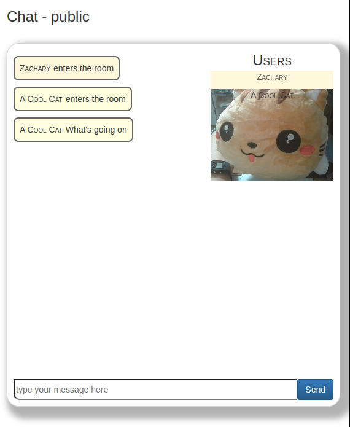

Hack-A-Day is a project I'm doing in November, where I try to make 30 new projects, in 30 days.

# Day 19: Hack-A-Crop

Talk and video chat with friends.

Demo available [here](https://tilde.za3k.com/hackaday/hang).

Source available on [github](https://github.com/za3k/day19_hang).

## Bugs

- If you say no to mic and video, you won't be able to see other people in the hang. If you set it to mic-only or video-only it works fine.
- The chat scrolls off the bottom of the screen

## Thanks

- Thanks to [webrtc.github.io](https://webrtc.github.io/samples/src/content/peerconnection/pc1/) for the simple [examples](https://webrtc.github.io/samples/src/content/peerconnection/pc1/js/main.js) of the complicated [WebRTC](https://web.dev/webrtc-basics/) protocols. Thanks also to [webrtc.org](https://webrtc.org/getting-started/peer-connections)
